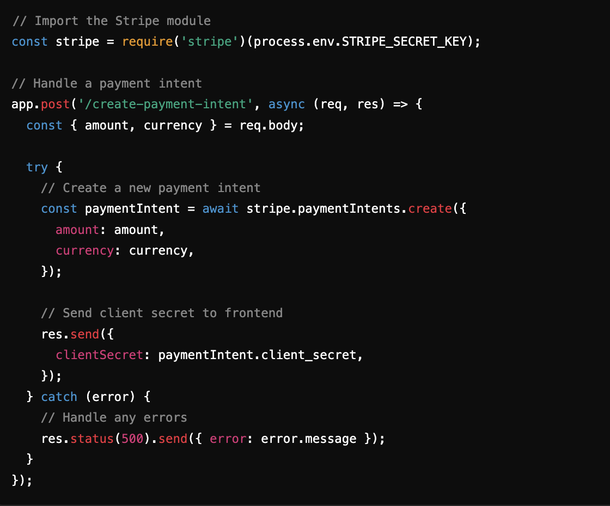

# Technical Writing Samples

## Sample 1: **Virtual Art Gallery Payment Integration using Stripe API (Mock Mode)**

**Link**: [VIA STUDIOS](https://github.com/kendacodes/Final-Project)

### Your Role:

I am the developer for this web app. I designed, implemented, and integrated the Stripe API in mock mode to simulate the payment process for the virtual art gallery. The content was independently developed and self-edited.

### Development Process:

- **Why I wrote it**: 
  The idea for this project came from a personal conversation with an artist friend. They expressed how difficult and expensive it was to get their work showcased in traditional galleries. This inspired me to create a virtual art gallery where artists can share and sell their work online, bypassing the high costs and barriers of physical galleries. My goal was to make art sales more accessible to independent artists by providing a seamless user experience for both viewing and purchasing art.

- **Target Audience**: 
  This app was built for independent artists and art collectors. The documentation I wrote was aimed at fellow developers who wanted to integrate Stripe into similar small-scale e-commerce projects, providing them with a starting point for implementing payment functionality.

- **Planning and Execution**: 
  I designed the app with a simple checkout system using Stripe's mock mode to simulate payments without real transactions. The process was as follows:

  - Configured Stripe Checkout to manage purchases.
  - Created a mock payment handler to simulate charging customers.
  - Implemented functionality to handle payment tokens and redirect users upon successful purchase.

  The following image showcases the Stripe API integration code:

  

  The system mimicked real-world payments using Stripe's sandbox environment, helping me validate the logic for handling tokens and transactions without charging real cards.

- **Constraints**: 
  Since I used Stripe in mock mode, I had to simulate payment success and failure scenarios without using real payment data. Additionally, time was a factor as I aimed to complete the project within a month for a demo to local artists.

- **Outcome**: 
  The virtual gallery received positive feedback from artists who were excited to have an affordable platform to showcase their work. The payment integration worked smoothly during tests, and the mock payment functionality demonstrated the app's potential for a production environment. Artists appreciated the flexibility and ease of use, with plans to launch a live version in the future.
