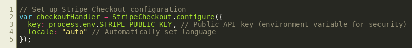
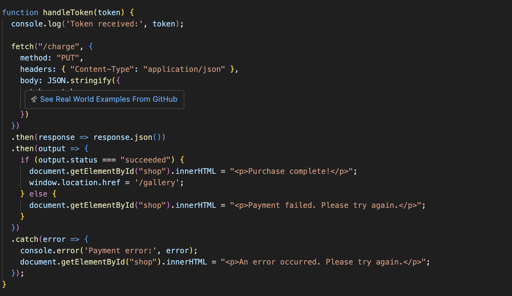
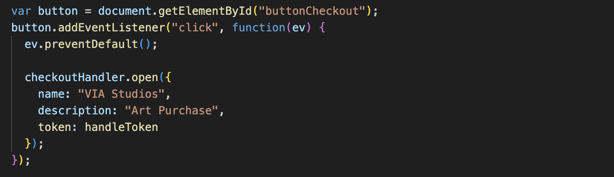
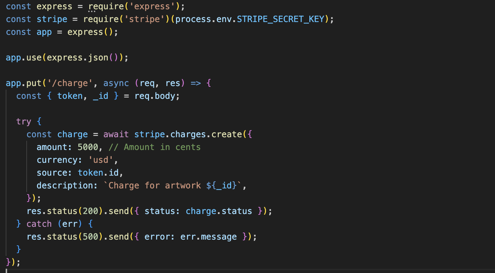

# Stripe API Integration Guide for Virtual Art Gallery

This guide demonstrates how to integrate the Stripe API into a web application to process payments. It uses a virtual art gallery as the example project and includes detailed explanations, code snippets, and implementation steps.

## Overview

This project uses:

- **Frontend**: Stripe Checkout for payment collection.
- **Backend**: Express.js to handle secure token processing and payment validation.

--------------------------------------------------------------------------------

## Step 1: Configure Stripe Checkout

Set up Stripe Checkout to handle payment processing. Store the **public API key** securely in an environment variable and use `StripeCheckout.configure()` to initialize the handler.

 

<!-- ```javascript var checkoutHandler = StripeCheckout.configure({ key: process.env.STRIPE_PUBLIC_KEY, // Public API key (environment variable for security) locale: "auto" // Automatically set language }); -->

 ### Explanation

**key:** Uses the public API key retrieved from environment variables. 
**locale:** Automatically sets the language based on the user's browser settings.

## Step 2: Handle Payment Tokens

When a user successfully initiates a payment, Stripe returns a token containing payment details. Define a function to process the token returned by Stripe after a user submits payment. The token is securely sent to the backend for processing.



### Explanation

**Token:** Contains sensitive payment data returned by Stripe.

**Backend Call:** Sends the token and artwork ID to the `/charge` endpoint on the backend.

**Response Handling:** Displays a success or error message based on the payment result.

**Error Handling:** Ensures graceful handling of network or payment failures.

## Step 3: Attach Event Listener to the Checkout Button

Set up an event listener on the checkout button to trigger the Stripe Checkout interface when clicked. 

### Explanation

**Event Listener:** Listens for clicks on the checkout button. 
**Prevent Default:** Stops the default form submission or page reload. 
**Open Checkout:** Opens the Stripe Checkout interface with your configurations.

## Backend: Process Payment

Create a backend endpoint to securely process payment tokens. 

### Explanation

**Token Validation:** The backend uses the secret API key to securely validate and process the payment token. 
**Charge Creation:** Charges the user for the specified amount (in cents) with the Stripe API. 
**Error Handling:** Sends appropriate HTTP status codes and messages to handle any errors that may arise during payment.

## Implementation in your Project!

1. **Set Up Your Environment:**

2. Install and configure Stripe:

```bash
npm install stripe express dotenv
```

- Set up environment variables

  - Create a `.env` file and add your Stripe public key::

```bash
STRIPE_PUBLIC_KEY=your-public-key
STRIPE_SECRET_KEY=your-secret-key
```

1. **Frontend Setup:**

2. Include the Stripe library:

```html
<script src="https://checkout.stripe.com/checkout.js"></script>
```

- Add a button in your HTML to trigger the checkout:

  ```html
  <button id="buttonCheckout">Buy Now</button>
  ```

- **Backend Implementation:**

  - Create the `/charge` endpoint to process payments:

- **Test the Integration:**

  - Use Stripe's mock test cards to simulate payments (e.g., `4242 4242 4242 4242`).
  - Monitor your server logs and Stripe dashboard for test transactions.

### **Final Tips**

- Use **test keys** and **mock cards** during development to avoid real transactions.
- Validate and sanitize all user inputs to ensure security.
- Use HTTPS for all communications between your frontend and backend to protect sensitive data.

## Thanks for Reading

This guide provides a comprehensive walkthrough of integrating Stripe Checkout into a virtual art gallery web application. By following the steps outlined in this guide, you will be able to understand how the Stripe Api was set in this App and hopefully apply the following steps to your project!:

1. **Set Up the Environment**
2. **Configure Stripe Checkout**
3. **Handle Payment Tokens**
4. **Set Up the Backend**
5. **Test the Integration**

This guide aims to provide a simplified, user-friendly payment solution when needing to simulate checkouts.

For more details or further assistance, please refer to the official [Stripe Documentation](https://stripe.com/docs).
